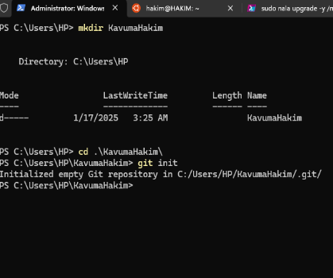
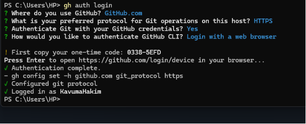
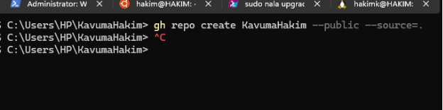
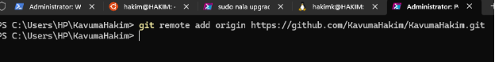

# Using the Gh GitHub CLI tool to manage Github Repositories.

-----

## Introduction:

Finding out about the gh tool:

Hearing about the gh tool, my first instinct took me to google search engine where I discovered what the tool is, what it is used for and how I can leverage it to boost productivity by doing my work in the command line without shuffling through webpages on the browser.

## Installation:

To install the tool the first google search result led to a github releases page for the tool with a list of links for builds of various operating systems. [Download Link](https://github.com/cli/cli/releases/latest)

Another link also included a documentation page found here: [documentation](https://cli.github.com/manual/)

## Assignment:

On the terminal, I created a new Repository with my name as the folder names.

*>>```mkdir KavumaHakim```*

*>>```cd KavumaHakim/```*

*>>```git init```*



Then I logged into my github account through the gh tool with the command:

*```gh auth login```* 



Created the repo on Github with:

*```gh repo create KavumaHakim --public --source=.```*



Then connected the local repo to the remote with:

*git remote add origin [https://github.com/KavumaHakim/KavumaHakim.git](https://github.com/KavumaHakim/KavumaHakim.git)*



*The Repo can be found here: [**Repo**](https://github.com/KavumaHakim/KavumaHakim)*
